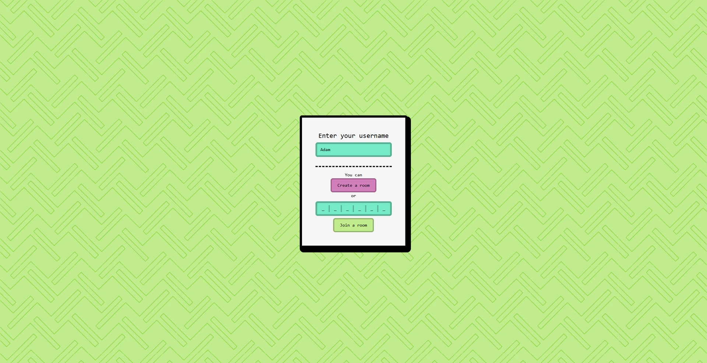

# madlibz 

Hi! Welcome to the online version of the popular card/tabletop game Mad Libs, made using SvelteKit and Express.js.

> NOTE! This project is not hosted anywhere, nor is it going to be. You can find out more in the [Current status](#curr-status) section.



## What is Mad Libs?

From [Wikipedia](https://en.wikipedia.org/wiki/Mad_Libs):

*"Mad Libs is a word game created by Leonard Stern and Roger Price. It consists of one player prompting others for a list of words to substitute for blanks in a story before reading aloud. The game is frequently played as a party game or as a pastime. It can be categorized as a phrasal template game."*

Official page: <https://madlibs.com>

## Features

### Game mechanics

The game consists of 4 stages:

**1. Before lobby:**

You are prompted to enter your username, and can either join or create a room.

**2. Lobby:**

The game master can set up the game as he wishes, which includes selecting or creating a custom story, while other players wait for the game to begin.

**3. Game:**

The players take turns to fill in the given prompt. They do it until all prompts have been filled out.

**4. Summary:**

The story is generated and can be viewed by all players. You can also download the story as an image file.

---

### Technical details

The game implements numerous mechanics:

**1. Dynamically created rooms.**

**2. Real-time gameloop,** which includes live chat, turn-based gameplay and live preview of other players' prompts.

**3. Smooth UI with seamingless page transitions.**

**4. Many animations.**

**5. Downloading summaries as easily-shareable images.**

---

### Tech stack

The game runs as a **SvelteKit** + **Express.js** app. Express.js is used to integrate with web sockets, managed using **socket.io**. **MongoDB** is used to store both static data (stories) and dynamic state data (active rooms/players). The design aspect is handled by **SkeletonUI** and **Tailwind**.

<h2 id="setup">Setup</h2>

In order to self-host the game, follow these steps:

1. Create a MongoDB cloud cluster / use an already existing one.

2. Create a database in the cluster, and name it `madlibz`.

3. Create two empty collections:

    - `active` - manages active rooms and players
    - `stories` - holds stories, that you can load into the game.

4. Add an **.env** file in the root of the cloned project, and input the variable:
```
MONGODB_URI=*YOUR_MONGO_URI*
```

5. Run the game with `npm run dev`

<h2 id="curr-status">Current status</h2>

Well, yeah... The project is not hosted on any public site, and can only be used locally, by following the steps listed in the [setup guide](#setup).

#### Why?

This app was always meant to serve as a fun project, which I could use to further my programming knowledge. Unfortunately, at this point the codebase has been unmantained for some time, which means that in order to make it serviceable and ready for deployment, a lot of migration and upgrades would be necessary. 

Another big factor is the usage of JavaScript, rather than TypeScript, which has lead to the game having a lot of bugs related directly to undesired types appearing throughout the code. Frankly, I believe a full migration to TypeScript is required to make the game run properly.

To sum it up - while the game is functional, it is by no means the final product, and would require too much time to polish.

#### So... now what?

Ultimately, even though the project isn't suited for production, I still believe it to be a cool application, with a lot of neat features and good overall structure. I have learned a tremendous amount through writing it, and am ultimately proud of what I was able to achieve. From now on it will serve as a great learning experience and part of my portfolio, but currently I would like to move on to other projects I have in mind.

**Thanks for reading!** Feel free to set up the project for yourself, and maybe even play it with your friends (I have, and it's extremely fun 😄)